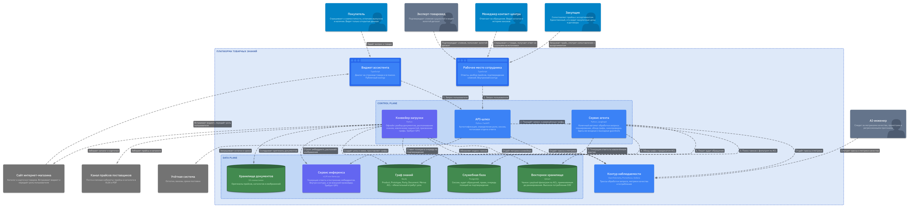
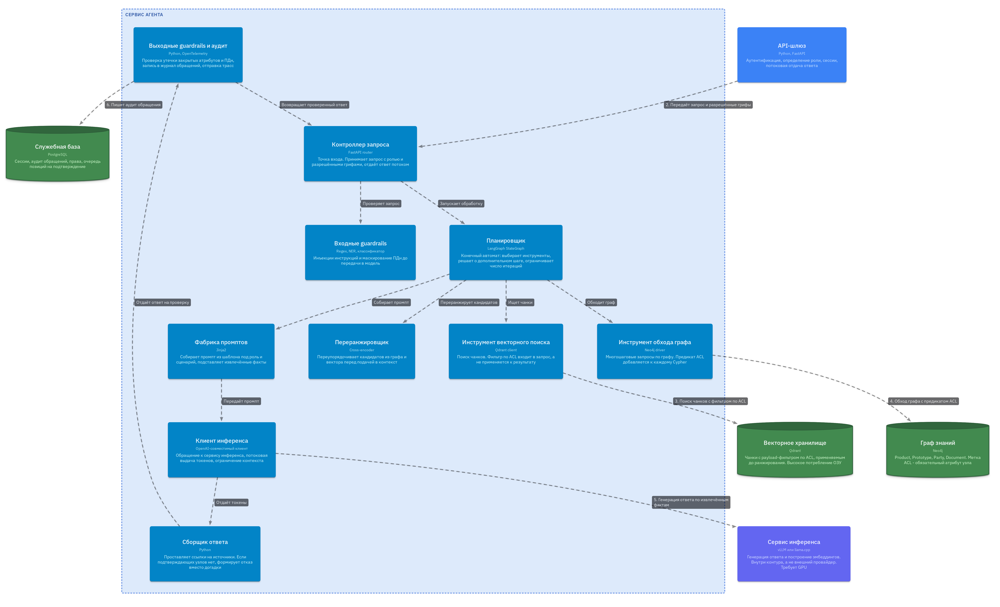
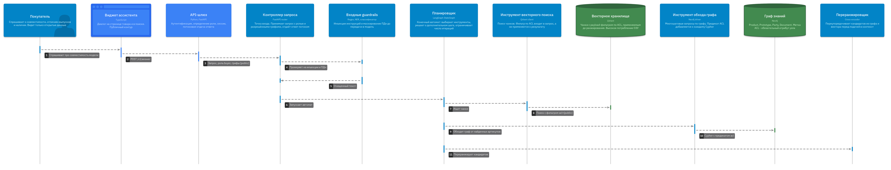
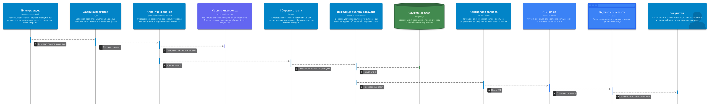
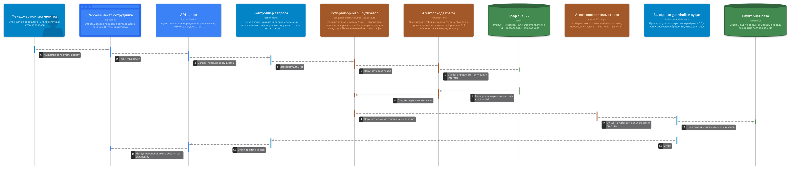

# Контекст

Репозиторий проекта: <https://github.com/SandalAndrey/otus_ai_architect>

**Заказчик** - интернет-магазин коллекционных масштабных моделей: более 15 000
позиций в наличии, около 400 автомобильных марок, порядка 600 производителей.

**Система** отвечает на товарные вопросы, извлекая факты обходом графа знаний, а
не векторным поиском по тексту. Запросы вида "что ещё выпускалось по этому
прототипу" или "чем отличаются два выпуска" в плоском поиске не решаются.

Три ограничения определяют все решения ниже:

1. Закрытый контур. Обращения к внешним LLM-API исключены архитектурно, поэтому
   сервис инференса находится внутри системы, а не за её границей.
2. Разграничение доступа на уровне узлов графа. Отсутствие утечки данных
   ограниченного доступа - блокирующий критерий приёмки.
3. На этапе разработки доступен только CPU, поэтому тяжёлая обработка документов
   вынесена в офлайн-конвейер.

Модель C4 описана кодом на LikeC4, все диаграммы ниже построены из одного
исходника [`docs/diagrams/model.c4`](https://github.com/SandalAndrey/otus_ai_architect/blob/main/docs/diagrams/model.c4).

# 1. Уровень 2. Диаграмма контейнеров



Контейнеры разделены на две плоскости, и это не оформительский приём.

**Control Plane** - то, что принимает решения: API-шлюз, сервис агента, конвейер
загрузки. **Data Plane** - то, что хранит и считает: сервис инференса, граф
знаний, векторное хранилище, служебная база, хранилище документов.

Разделение нужно, чтобы масштабировать эти части независимо. Нагрузка на них
разной природы: агент упирается в задержки обращений к хранилищам, а инференс - в
видеопамять и пропускную способность.

| Контейнер                | Технология                | Назначение                                                     |
| ------------------------ | ------------------------- | -------------------------------------------------------------- |
| Виджет ассистента        | TypeScript                | Диалог на странице товара, публичный контур                    |
| Рабочее место сотрудника | TypeScript                | Ответы, разбор прайсов, подтверждение слияний                  |
| API-шлюз                 | Python, FastAPI           | Аутентификация, определение роли, сессии, потоковая отдача     |
| Сервис агента            | Python, LangGraph         | Конечный автомат обработки запроса                             |
| Конвейер загрузки        | Python                    | Офлайн: разбор документов, распознавание, извлечение сущностей |
| Сервис инференса         | vLLM или llama.cpp        | Генерация и эмбеддинги, требует GPU                            |
| Граф знаний              | Neo4j                     | Product, Prototype, Party, Document с метками доступа          |
| Векторное хранилище      | Qdrant                    | Чанки с фильтром по метке, высокое потребление ОЗУ             |
| Служебная база           | PostgreSQL                | Сессии, аудит, права, очередь на подтверждение                 |
| Хранилище документов     | S3-совместимое            | Оригиналы прайсов и изображений                                |
| Контур наблюдаемости     | OpenTelemetry, Prometheus | Трассы и метрики                                               |

Внешнего поставщика LLM на диаграмме нет намеренно. В типовой схеме RAG там стоит
облачный провайдер, и туда же выносят фильтрацию персональных данных. У нас
модель внутри контура, поэтому фильтрация решает другую задачу: не выпустить
наружу закрытые данные в ответе пользователю.

# 2. Уровень 3. Компоненты сервиса агента



Раскрыт именно этот контейнер: он лежит на пути пользовательского сценария,
поэтому шаги диаграмм последовательности ссылаются на его компоненты.

Компоненты делятся на два вида, и на диаграмме это показано цветом. У агента
поведение зависит от вывода модели, у детерминированного компонента нет.

| Компонент | Вид | Технология | Ответственность |
| --- | --- | --- | --- |
| Контроллер запроса | Детерминированный | FastAPI router | Точка входа, приём грифов, потоковая отдача |
| Входные guardrails | Детерминированный | Regex, NER, классификатор | Инъекции инструкций, маскирование персональных данных |
| Супервизор-маршрутизатор | Агент | LangGraph StateGraph, Plan-and-Execute | Класс вопроса, план извлечения, решение о доборе, предел итераций |
| Агент векторного поиска | Агент | ReAct, Qdrant client | Переформулирование, раскрытие алиасов, фильтр по грифам в запросе |
| Агент обхода графа | Агент | ReAct, Neo4j driver | Cypher, выбор глубины, предикат доступа в каждом запросе |
| Переранжировщик | Детерминированный | bge-reranker-v2-m3 | Переупорядочивание кандидатов перед подачей в контекст |
| Агент-составитель ответа | Агент | Chain-of-Thought | Сборка ответа из фактов, простановка ссылок |
| Агент-верификатор | Агент | Chain-of-Thought | Сверка утверждений с узлами, отказ вместо догадки |
| Клиент инференса | Детерминированный | OpenAI-совместимый | Единственная точка обращения к модели, предел контекста |
| Выходные guardrails и аудит | Детерминированный | Python, OpenTelemetry | Проверка утечки, журнал, трассы |

Три вещи заслуживают пояснения.

**Guardrails и переранжировщик намеренно не агенты.** Соблазн назвать агентами
всё подряд велик, но проверяемость guardrails на приёмке держится ровно на том,
что их результат воспроизводим и не зависит от вывода модели.

**Супервизор ограничивает число итераций.** Без предела агент способен
зацикливаться на вопросе, ответа на который в графе просто нет: каждый следующий
шаг будет казаться ему осмысленным. Предел превращает бесконечный поиск в
честный отказ.

**Верификатор стоит после составителя, а не перед ним.** Сверять с фактами можно
только готовый текст. Отказ при полном отсутствии подтверждающих узлов принимает
супервизор раньше и до генерации не доводит.

Состав и обоснование иерархии - [ADR-0007](https://github.com/SandalAndrey/otus_ai_architect/blob/main/docs/adr/0007-multiagent-online-path.md).

# 3. Диаграммы последовательности

Сценарий обработки вопроса разбит на две диаграммы. Причина не косметическая:
семнадцать линий жизни в одной диаграмме нечитаемы, а граница между извлечением
фактов и генерацией ответа совпадает с фазами автомата.

Под каждой диаграммой приведён перечень шагов. Диаграммы вставлены в высоком
разрешении и читаются при увеличении, а таблица позволяет свериться с составом
компонентов уровня 3, не прибегая к масштабированию.

## Сценарий 1а. Приём запроса и извлечение фактов



| Шаг | От | К | Действие |
| --- | --- | --- | --- |
| 1 | Покупатель | Виджет ассистента | Спрашивает про совместимость модели |
| 2 | Виджет ассистента | API-шлюз | POST /v1/answer |
| 3 | API-шлюз | Контроллер запроса | Запрос, грифы [public] |
| 4 | Контроллер запроса | Входные guardrails | Проверяет на инъекции и ПДн |
| 5 | Входные guardrails | Контроллер запроса | Очищенный текст |
| 6 | Контроллер запроса | Супервизор | Запускает автомат |
| 7 | Супервизор | Клиент инференса | Классифицирует вопрос и строит план |
| 8 | Супервизор | Агент векторного поиска | Поручает поиск, класс B |
| 9 | Агент векторного поиска | Векторное хранилище | Поиск с фильтром acl=[public] |
| 10 | Супервизор | Агент обхода графа | Поручает обход графа параллельно |
| 11 | Агент обхода графа | Граф знаний | Cypher с предикатом acl |
| 12 | Агент векторного поиска | Переранжировщик | Кандидаты из вектора |
| 13 | Агент обхода графа | Переранжировщик | Кандидаты из графа |
| 14 | Переранжировщик | Супервизор | Отранжированные факты |

Покупатель спрашивает о совместимости. Шлюз разворачивает роль в перечень
разрешённых грифов и передаёт его дальше; сама роль границу шлюза не пересекает.
Оба агента извлечения получают перечень и подставляют его в запрос к хранилищу.

Шаги 8 и 10 выполняются параллельно, а не по очереди. Это и есть причина
выбрать Plan-and-Execute для супервизора вместо сплошного ReAct: в ReAct
следующий вызов начинается после оценки предыдущего, и два извлечения
складываются во времени.

## Сценарий 1б. Генерация ответа и доставка



| Шаг | От | К | Действие |
| --- | --- | --- | --- |
| 1 | Супервизор | Агент-составитель | Поручает сборку ответа из фактов |
| 2 | Агент-составитель | Клиент инференса | Генерация |
| 3 | Клиент инференса | Сервис инференса | Потоковая выдача токенов |
| 4 | Агент-составитель | Агент-верификатор | Ответ со ссылками на сверку |
| 5 | Агент-верификатор | Клиент инференса | Сверяет утверждения с узлами |
| 6 | Агент-верификатор | Супервизор | Подтверждено |
| 7 | Супервизор | Выходные guardrails и аудит | Отдаёт ответ на проверку |
| 8 | Выходные guardrails и аудит | Служебная база | Пишет аудит |
| 9 | Выходные guardrails и аудит | Контроллер запроса | Проверенный ответ |
| 10 | Контроллер запроса | API-шлюз | Поток SSE |
| 11 | API-шлюз | Виджет ассистента | Ответ со ссылками |
| 12 | Виджет ассистента | Покупатель | Показывает ответ и источники |

Составитель собирает ответ из фактов и проставляет ссылки, верификатор сверяет
каждое утверждение с извлечёнными узлами, выходные фильтры проверяют результат
и пишут аудит. Если верификатор не подтверждает утверждение, ответ уходит на
переделку либо заменяется отказом.

## Сценарий 2. Запрос данных вне уровня доступа



| Шаг | От                          | К                           | Действие                                       |
| --- | --------------------------- | --------------------------- | ---------------------------------------------- |
| 1   | Менеджер контакт-центра     | Рабочее место сотрудника    | Какая маржа по этому бренду                    |
| 2   | Рабочее место сотрудника    | API-шлюз                    | POST /v1/answer                                |
| 3   | API-шлюз                    | Контроллер запроса          | Запрос, грифы [public, internal]               |
| 4   | Контроллер запроса          | Супервизор                  | Запускает автомат                              |
| 5   | Супервизор                  | Агент обхода графа          | Поручает обход графа                           |
| 6   | Агент обхода графа          | Граф знаний                 | Cypher с предикатом acl=[public, internal]     |
| 7   | Граф знаний                 | Агент обхода графа          | Ноль узлов: маржа имеет гриф confidential      |
| 8   | Агент обхода графа          | Супервизор                  | Подтверждающих узлов нет                       |
| 9   | Супервизор                  | Агент-составитель           | Поручает отказ, до генерации не доводит        |
| 10  | Агент-составитель           | Выходные guardrails и аудит | Отказ "нет данных" без упоминания причины      |
| 11  | Выходные guardrails и аудит | Служебная база              | Пишет аудит и число отсечённых узлов           |
| 12  | Выходные guardrails и аудит | Контроллер запроса          | Отказ                                          |
| 13  | Контроллер запроса          | API-шлюз                    | Ответ без источников                           |
| 14  | API-шлюз                    | Рабочее место сотрудника    | Нет данных, предложить обратиться к закупщику  |

Менеджер спрашивает о маржинальности. Ключевой момент: **запрос к графу
возвращает ноль узлов**, потому что узлы с маржой имеют закрытый гриф, а в
предикате его нет. Отказ возникает из-за отсутствия данных, а не из-за проверки
после формирования ответа.

Разница принципиальна. При постфильтрации закрытые данные успевают побывать в
контексте модели, в кэше и в трассировке - и это уже утечка, даже если
пользователь их не увидел.

## Связность с уровнем 3

Все десять компонентов сервиса агента участвуют хотя бы в одном сценарии.

| Компонент | Сценарий |
| --- | --- |
| Контроллер запроса | 1а, 1б, 2 |
| Входные guardrails | 1а |
| Супервизор-маршрутизатор | 1а, 1б, 2 |
| Агент векторного поиска | 1а |
| Агент обхода графа | 1а, 2 |
| Переранжировщик | 1а |
| Агент-составитель ответа | 1б, 2 |
| Агент-верификатор | 1б |
| Клиент инференса | 1а, 1б |
| Выходные guardrails и аудит | 1б, 2 |

# 4. Спецификация API

Полный файл: [`backend/openapi.yaml`](https://github.com/SandalAndrey/otus_ai_architect/blob/main/backend/openapi.yaml),
формат OpenAPI 3.1. Ниже существенные фрагменты.

## Разграничение ответственности

Шлюз аутентифицирует пользователя, определяет роль и разворачивает её в перечень
грифов. Дальше границы шлюза роль не уходит: сервис агента получает только
перечень и подставляет его в запросы к хранилищам.

Роли во внутреннем запросе нет намеренно. Пока она передаётся, у сервиса агента
два источника сведений о правах, и рано или поздно код начнёт ветвиться по роли -
ровно тот отказ, ради предотвращения которого разграничение и вынесено на шлюз.
Компонент не должен получать данные, которыми ему запрещено пользоваться.

Для аудита роль тоже не нужна: запись сервиса агента связывается с журналом шлюза
по `session_id` и `trace_id`, а роль там уже записана в момент аутентификации.

Разделение делает права проверяемыми в отрыве от аутентификации: тест на
разграничение доступа не требует поднимать вход в систему.

## Запрос

```yaml
AnswerRequest:
  type: object
  required: [question, session_id, acl]
  properties:
    question: { type: string, minLength: 3, maxLength: 2000 }
    session_id: { type: string, format: uuid }
    acl:
      type: array
      minItems: 1
      items: { type: string, enum: [public, internal, confidential] }
    stream: { type: boolean, default: false }
    max_steps: { type: integer, minimum: 1, maximum: 6, default: 3 }
```

Поле `max_steps` не декоративное: это тот самый предел итераций планировщика.

Пример запроса покупателя:

```json
{
  "question": "Подойдёт ли витрина от Norev к модели 1:18 Mercedes W124",
  "session_id": "018f3a2b-7c1e-7a3d-9f42-6b0c5d8e1a77",
  "acl": ["public"],
  "stream": false
}
```

## Ответ

```json
{
  "answer": "Витрина Norev 1:18 подходит: высота 120 мм против 118 мм. Артикул 187001.",
  "citations": [
    { "type": "product", "id": "NOR187001", "title": "Витрина Norev 1:18" },
    { "type": "document", "id": "doc-catalog-norev-2026", "title": "Каталог Norev, с. 44" }
  ],
  "refusal": null,
  "steps": 4,
  "trace_id": "4bf92f3577b34da6a3ce929d0e0e4736",
  "usage": { "prompt_tokens": 1840, "completion_tokens": 96, "latency_ms": 1420 }
}
```

Отказ приходит в том же формате, с заполненным `refusal`:

```json
{
  "answer": null,
  "citations": [],
  "refusal": {
    "code": "no_supporting_data",
    "message": "Нет данных, подтверждающих ответ. Уточните у закупщика."
  },
  "steps": 2,
  "trace_id": "9c1e0a55b2f34e17b4de5c2a1f0d8e93"
}
```

Ответ намеренно не содержит числа отсечённых фильтром узлов. Такая величина
сообщала бы, что данные существуют, но недоступны, и обесценивала бы выбор кода
200. Для разбора обращений она пишется сервисом агента прямо в журнал аудита и
границу сервиса не пересекает.

## Коды ответов

| Код | Когда                                            | Что делает вызывающая сторона                    |
| --- | ------------------------------------------------ | ------------------------------------------------ |
| 200 | Ответ сформирован либо сформирован отказ         | Показывает `answer` или `refusal.message`        |
| 400 | Запрос не проходит проверку схемы                | Ошибка интеграции, чинится на стороне шлюза      |
| 422 | Отклонён входными фильтрами: инъекция инструкций | Показывает нейтральное сообщение, пишет инцидент |
| 429 | Превышен предел частоты                          | Повторяет через `Retry-After`                    |
| 503 | Инференс или хранилище недоступны                | Переходит на обычный поиск по каталогу           |
| 504 | Не уложились во время обработки                  | То же, деградация вместо ошибки                  |

**Отказ по правам возвращает 200, а не 403.** Если бы отдавали 403, по коду
ответа можно было бы установить сам факт существования закрытого документа:
достаточно перебрать вопросы и смотреть, где меняется код. Поэтому снаружи
отсутствие данных и отсутствие прав неразличимы.

## Потоковый режим

При `stream: true` ответ отдаётся как Server-Sent Events: события `token` с
кусками текста, затем одно событие `done` с итоговым объектом.

```
event: token
data: {"text":"Витрина "}

event: done
data: {"answer":"...","citations":[...],"refusal":null,"trace_id":"4bf92f35"}
```

Источники приходят только в финальном событии: атрибуция проверяется на
последнем шаге, и до его завершения список цитат не окончателен.

# Документы проекта

- [Модель C4](https://github.com/SandalAndrey/otus_ai_architect/blob/main/docs/diagrams/model.c4)
- [Спецификация API](https://github.com/SandalAndrey/otus_ai_architect/blob/main/backend/openapi.yaml)
- [Бизнес-функциональные требования](https://github.com/SandalAndrey/otus_ai_architect/blob/main/docs/01-business-functional-requirements.md)
- [Трассировка: вопрос - риск - требование - работа - приёмка](https://github.com/SandalAndrey/otus_ai_architect/blob/main/docs/10-traceability.md)
- [Реестр архитектурных решений](https://github.com/SandalAndrey/otus_ai_architect/tree/main/docs/adr)
